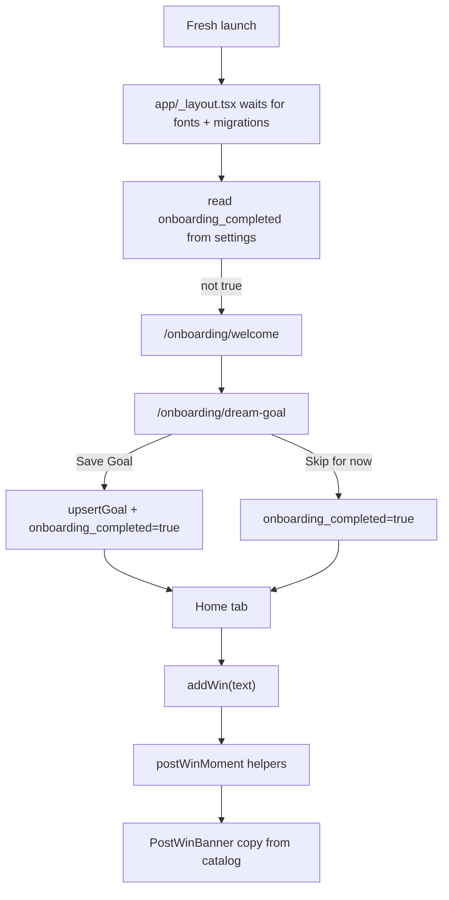

# Phase 6 — Pattern Map

**Created:** 2026-05-13
**Phase:** Onboarding + Copy System

## Closest Existing Analogs

| New / Modified File | Role | Closest Analog | Pattern to Reuse |
|---------------------|------|----------------|------------------|
| `src/copy/catalog.ts` | Typed copy catalog and deterministic variants | `src/constants/examplePrompts.ts`, `src/utils/streakLabel.ts`, `src/notifications/notificationService.ts` | Export simple constants/functions; deterministic seed selection; no React dependencies |
| `src/utils/postWinMoment.ts` | Pure milestone/comeback helper | `src/utils/dateUtils.ts`, `src/utils/promptUtils.ts` | Pure functions, local `date_key`, noon-anchor date math, Jest-first tests |
| `src/__tests__/copyCatalog.test.ts` | Copy invariant tests | `src/__tests__/streakLabel.test.ts`, `src/__tests__/notificationService.test.ts` | Audit banned guilt/shame terms; deterministic distribution tests |
| `src/__tests__/postWinMoment.test.ts` | Milestone/comeback tests | `src/__tests__/dateUtils.test.ts`, `src/__tests__/historyUtils.test.ts` | Date-key fixture tables; boundary tests around gaps and thresholds |
| `src/db/repositories/onboarding.ts` | Small settings wrapper | `src/db/repositories/settings.ts` | Thin async wrapper around `getSetting` / `setSetting`; no new table |
| `app/_layout.tsx` | First-run route gate | Existing root layout in `app/_layout.tsx` | Keep migration/font splash readiness, then read settings; avoid tab flash |
| `app/onboarding/welcome.tsx` | First onboarding screen | `app/(tabs)/index.tsx` empty state | `SafeAreaView bg-background`, trophy asset, centered display copy, orange CTA |
| `app/onboarding/dream-goal.tsx` | Skippable goal setup | `app/(tabs)/goal.tsx`, `src/components/GoalEditor.tsx` | Reuse Dream Goal validation/repository behavior, lighter onboarding layout |
| `src/components/PostWinBanner.tsx` | Home feedback banner | `src/components/WinCard.tsx`, `src/components/settings/SettingsSection.tsx` | `bg-surface`, `rounded-xl`, `border-border`, restrained non-modal feedback |
| `app/(tabs)/index.tsx` | Home banner integration | Existing Home save flow | Keep `WinInputArea` and `FlatList`; derive banner after `addWin()` |

## Data Flow

## Implementation Constraints

- Use `settings.onboarding_completed`; do not add a schema table or AsyncStorage.
- Onboarding routes must live outside `(tabs)` so the tab shell is hidden until completion.
- Use `router.replace`, not `router.push`, for onboarding transitions.
- Keep notification permission timing in `useWinsStore.addWin()`; onboarding must not request notification permission.
- Compare calendar gaps with local `YYYY-MM-DD` date keys and the noon-anchor pattern from `dateUtils.ts`.
- Keep copy catalog extraction scoped to emotional-tone states; do not move every static label into the catalog.
- Preserve existing public helper signatures: `streakLabel(streak)` and notification `pickPromptForDate(dateKey)`.

## Verification Hooks

- `npx jest --runInBand src/__tests__/copyCatalog.test.ts`
- `npx jest --runInBand src/__tests__/postWinMoment.test.ts`
- `npx jest --runInBand src/__tests__/streakLabel.test.ts src/__tests__/notificationService.test.ts`
- Fresh-install manual path: Welcome -> Dream Goal setup -> Home, with tabs hidden until completion.
